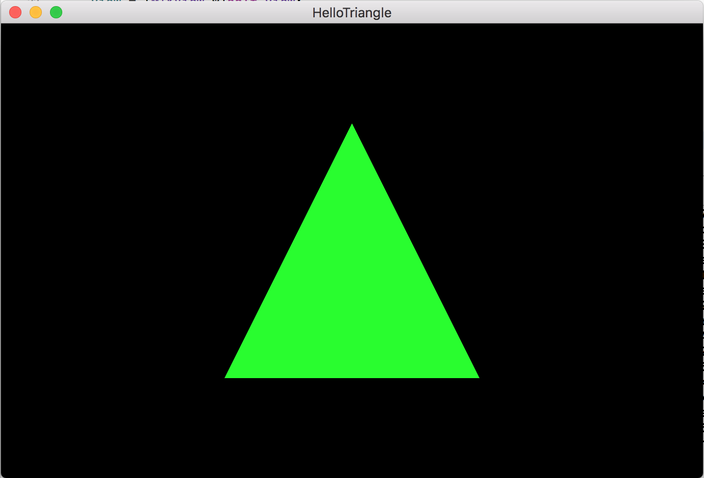
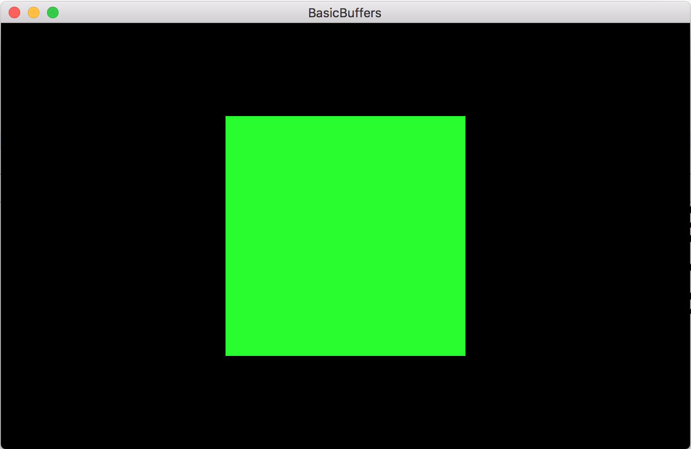

# Metal Samples
A collection of Metal samples with Xcode 10.0.

## Hello Triangle Sample
This sample shows you how to draw a static triangle using a rendering pipeline.

## Basic Buffers Sample
This sample shows you how to draw a quad using basic buffers.
